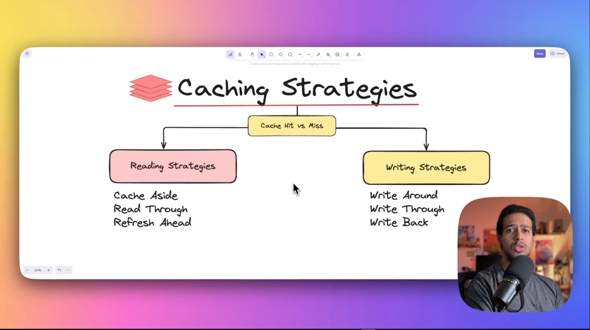
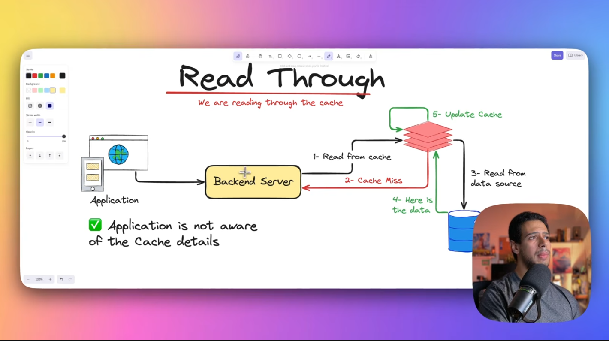
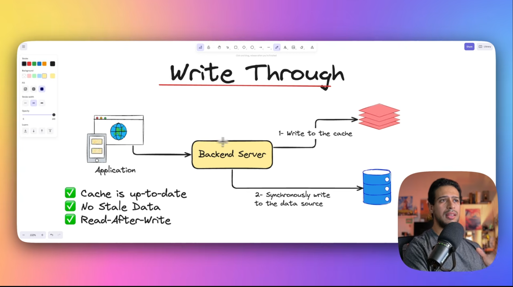
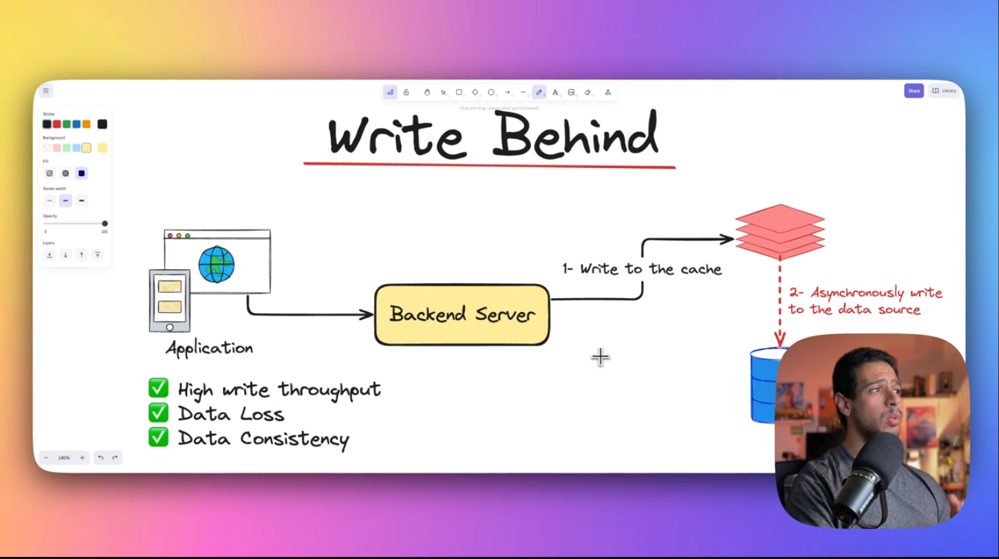
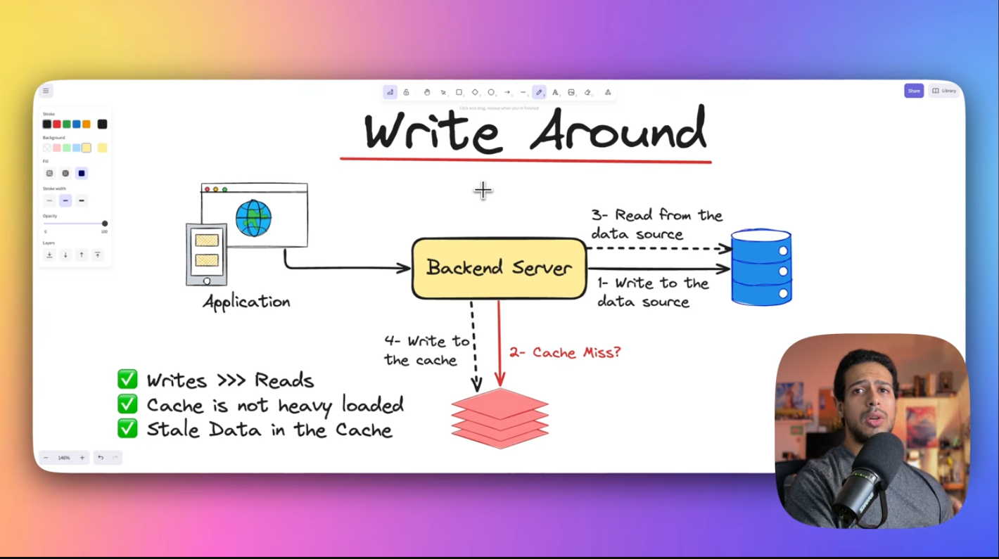

# Redis

## reading strategies

### Cash Aside

### Read Throw

## writing strategies

### Write Throw

### Write Bihind

### Write around

### Redis Cache Plugin

WordPress uses the Redis Cache plugin to communicate with the Redis server.

Redis itself is a separate service that stores cached data in memory (RAM). WordPress does not directly manage the Redis server. The Redis Cache plugin acts as the integration layer between WordPress's Object Cache system and Redis.

The communication works like this:

WordPress
    │
    │ WordPress Object Cache API
    ▼
Redis Cache Plugin
    │
    │ Redis protocol
    ▼
Redis Server

When WordPress needs to cache an object, the Redis Cache plugin sends that object to the Redis server. When WordPress needs the object again, the plugin asks Redis for it.

For example:

WordPress → Redis Cache Plugin → Redis
                                      │
                                      ▼
                              Cached WordPress object

This allows WordPress to retrieve frequently used objects from Redis's memory instead of repeatedly requesting the same data from MariaDB.

Why do we need the plugin?

The Redis server only provides the storage and caching service. It does not automatically know how WordPress's object-cache system works.

The Redis Cache plugin connects the two systems:

WordPress Object Cache
        ↓
Redis Cache Plugin
        ↓
Redis Server

Therefore, the plugin is not Redis itself. It is the WordPress-side integration that allows WordPress to use Redis as its object cache.

In our Docker setup

The Redis server runs in a separate container. WordPress communicates with it through the Docker network using the service name redis and the default Redis port 6379:

WordPress container
        │
        │ redis:6379
        ▼
Redis container

The configuration tells WordPress where the Redis server is:

WP_REDIS_HOST = redis
WP_REDIS_PORT = 6379

After enabling the Redis integration, WordPress can use Redis to store and retrieve cached objects.